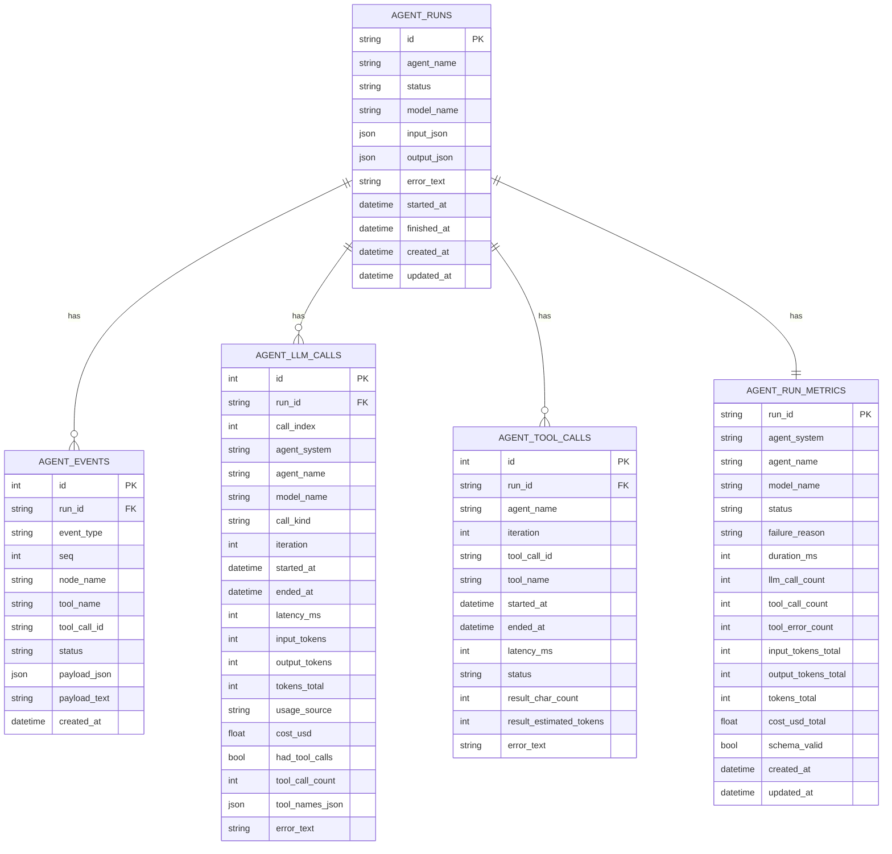

# Agent Metrics Architecture

This document explains how runtime metrics are produced by `SSEHandrolledAgent`, persisted by API services/repositories, and exposed through metrics endpoints.

## Overview

The runtime now emits three telemetry streams:

1. `agent events` (existing): timeline events such as `tool_call`, `tool_result`, `assistant`.
2. `llm call metrics` (expanded): one record per model invocation.
3. `tool execution metrics` (new): one record per tool execution.

`provider` token usage is authoritative when available. `estimated` usage is only used when provider usage is absent.

## Runtime Metric Flow

```mermaid
flowchart LR
  A[SSEHandrolledAgent loop] --> B[LLM call]
  B --> C{Provider token usage available?}
  C -->|Yes| D[Emit LLM metric usage_source=provider]
  C -->|No| E[Fallback token estimation]
  E --> D

  B --> F[Tool calls recovered/parsed]
  F --> G[Execute tool(s)]
  G --> H[Emit tool execution metric]

  D --> I[agent_runs_service handlers]
  H --> I
  I --> J[agent_metrics_repository]
  J --> K[(agent_llm_calls)]
  J --> L[(agent_tool_calls)]

  A --> M[Emit agent events]
  M --> N[(agent_events)]
```

## Token Source Rules

### LLM input/output tokens

`SSEHandrolledAgent` telemetry uses this precedence for each LLM call:

1. **Provider usage** (`usage_metadata` or `response_metadata.token_usage`)  
   - persisted as `usage_source = "provider"`
2. **Fallback estimation** (canonical serialization)  
   - persisted as `usage_source = "estimated"`

### Fallback canonicalization

Fallback estimation intentionally serializes only model-relevant fields.

Prompt/input estimation uses canonical message serialization:
- role
- normalized content
- assistant tool-calls (if present)
- relevant provider function/tool metadata (`additional_kwargs.function_call`, `additional_kwargs.tool_calls`)
- tool message metadata (`name`, `status`, `tool_call_id`)

Assistant output fallback includes:
- assistant `content`
- assistant `tool_calls`
- relevant function/tool fields from `additional_kwargs`

This avoids undercounting tool-calling turns while avoiding full object dumps.

## Database Model



## API Contracts (Metrics-Related)

## `GET /api/agent-runs/{run_id}/metrics`

Response type: `AgentRunMetricsDetail`

- `run_id: str`
- `metrics: AgentRunMetricsRead | null`
- `llm_calls: AgentLLMCallRead[]`
- `tool_calls: AgentToolCallRead[]`

### `AgentLLMCallRead`

| Field | Type |
|---|---|
| `id` | `int` |
| `run_id` | `str` |
| `call_index` | `int` |
| `agent_system` | `str` |
| `agent_name` | `str` |
| `model_name` | `str \| null` |
| `call_kind` | `str` |
| `iteration` | `int \| null` |
| `started_at` | `datetime` |
| `ended_at` | `datetime` |
| `latency_ms` | `int` |
| `input_tokens` | `int` |
| `output_tokens` | `int` |
| `tokens_total` | `int` |
| `usage_source` | `"provider" \| "estimated" \| str` |
| `had_tool_calls` | `bool \| null` |
| `tool_call_count` | `int \| null` |
| `tool_names` | `str[]` |
| `cost_usd` | `float \| null` |
| `error_text` | `str \| null` |

### `AgentToolCallRead`

| Field | Type |
|---|---|
| `id` | `int` |
| `run_id` | `str` |
| `agent_name` | `str` |
| `iteration` | `int` |
| `tool_call_id` | `str \| null` |
| `tool_name` | `str` |
| `started_at` | `datetime` |
| `ended_at` | `datetime` |
| `latency_ms` | `int` |
| `status` | `str` |
| `result_char_count` | `int` |
| `result_estimated_tokens` | `int` |
| `error_text` | `str \| null` |

## `GET /api/agent-runs/metrics/summary`

Response type: `AgentRunMetricsSummary`

| Field | Type |
|---|---|
| `total_runs` | `int` |
| `successful_runs` | `int` |
| `success_rate` | `float` |
| `schema_valid_rate` | `float \| null` |
| `tool_error_rate` | `float` |
| `timeout_or_stuck_rate` | `float` |
| `p50_duration_ms` | `float \| null` |
| `p95_duration_ms` | `float \| null` |
| `p50_llm_call_count` | `float \| null` |
| `p95_llm_call_count` | `float \| null` |
| `p50_tokens_total` | `float \| null` |
| `p95_tokens_total` | `float \| null` |
| `cost_per_successful_run` | `float \| null` |

## `GET /api/agent-runs/{run_id}/events` and `/events/stream`

These remain event-timeline APIs. They do not return `agent_tool_calls` records directly, but remain useful for reconstructing behavioral traces.

## Notes on Backward Compatibility

- Existing event persistence shape is unchanged.
- `llm_calls` response is additive (new optional fields).
- `tool_calls` is additive on `GET /metrics`.
- Legacy rows without new columns map cleanly with `null` values for additive fields.
