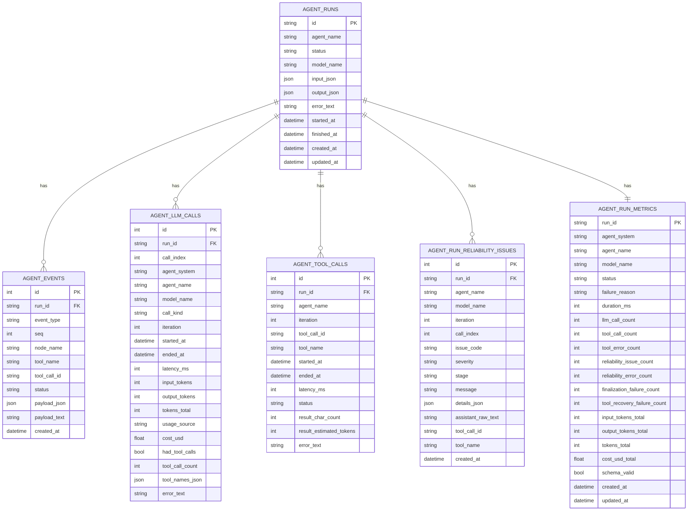

# Agent Metrics and Reliability Telemetry

This document explains how runtime telemetry is produced by `AgentKernel`, persisted by API services/repositories, and exposed through metrics endpoints.

## Overview

The runtime emits and persists five telemetry streams:

1. `agent events`: timeline events such as `tool_call`, `tool_result`, `assistant`, and reliability `error` events.
2. `llm call metrics`: one record per model invocation.
3. `tool execution metrics`: one record per tool execution.
4. `run aggregate metrics`: one row per run in `agent_run_metrics`.
5. `reliability issues`: one row per reliability anomaly in `agent_run_reliability_issues`.

`provider` token usage is authoritative when available. `estimated` usage is used only when provider usage is absent.

## Runtime Flow

```mermaid
flowchart LR
  A[AgentKernel loop] --> B[LLM call]
  B --> C{Provider token usage available?}
  C -->|Yes| D[Emit LLM metric usage_source=provider]
  C -->|No| E[Fallback token estimation]
  E --> D

  B --> F[Tool calls recovered/parsed]
  F --> G[Execute tool(s)]
  G --> H[Emit tool execution metric]

  D --> I[agent_runs_service handlers]
  H --> I
  I --> J[agent_metrics_repository]
  J --> K[(agent_llm_calls)]
  J --> L[(agent_tool_calls)]

  A --> M[Emit agent events]
  M --> N[(agent_events)]

  I --> O[Post-run reliability analysis]
  O --> P[(agent_run_reliability_issues)]
  O --> Q[Run status policy]
  Q --> R[(agent_runs)]
  O --> S[(agent_run_metrics)]
```

## Reliability Policy

### Run status behavior

Reliability issues are always logged and counted, but they do **not** change run status by themselves.

- Run `status=failed` remains reserved for execution failures (exceptions/timeouts/cancel).
- Reliability anomalies (including tool-call parse/recovery and final-output parse issues) are tracked in:
  - `agent_run_reliability_issues`
  - additive reliability counters in `agent_run_metrics`
  - `error` timeline events with `payload_json.reliability_issue`

### Reliability issue taxonomy

| Issue Code | Stage | Typical Meaning | Severity |
|---|---|---|---|
| `assistant_tool_call_json_unparseable` | `tool_recovery` | Assistant output looked like tool JSON but could not be parsed. | `warning` |
| `assistant_tool_call_recovery_failed` | `tool_recovery` | Tool-call recovery failed before finalization. | `error` |
| `structured_output_generation_failed` | `structured_output` | Structured-output call errored and fallback path was used. | `warning` |
| `final_output_missing` | `finalization` | No final output was produced. | `error` |
| `final_output_unparseable` | `finalization` | Final output text existed but could not be parsed into JSON. | `error` |
| `final_output_schema_invalid` | `finalization` | Final output JSON did not validate against expected output model. | `warning` |

## Database Model



## API Contracts

## `GET /api/agent-runs/{run_id}/metrics`

Response type: `AgentRunMetricsDetail`

- `run_id: str`
- `metrics: AgentRunMetricsRead | null`
- `llm_calls: AgentLLMCallRead[]`
- `tool_calls: AgentToolCallRead[]`
- `reliability_summary: AgentRunReliabilitySummary | null`

### `AgentRunMetricsRead` (reliability-related fields)

| Field | Type |
|---|---|
| `reliability_issue_count` | `int` |
| `reliability_error_count` | `int` |
| `finalization_failure_count` | `int` |
| `tool_recovery_failure_count` | `int` |

### `AgentRunReliabilitySummary`

| Field | Type |
|---|---|
| `total_issues` | `int` |
| `error_issues` | `int` |
| `by_code` | `AgentRunReliabilityIssueCount[]` |

### `AgentRunReliabilityIssueCount`

| Field | Type |
|---|---|
| `issue_code` | `str` |
| `count` | `int` |

## `GET /api/agent-runs/{run_id}/reliability-issues`

Query params:

- `issue_code: str | null`
- `limit: int`
- `offset: int`

Response type: `AgentRunReliabilityIssuePage`

| Field | Type |
|---|---|
| `run_id` | `str` |
| `issues` | `AgentRunReliabilityIssueRead[]` |
| `next_offset` | `int` |
| `total_count` | `int` |

### `AgentRunReliabilityIssueRead`

| Field | Type |
|---|---|
| `id` | `int` |
| `run_id` | `str` |
| `agent_name` | `str` |
| `model_name` | `str \| null` |
| `iteration` | `int \| null` |
| `call_index` | `int \| null` |
| `issue_code` | `str` |
| `severity` | `str` |
| `stage` | `str` |
| `message` | `str` |
| `details_json` | `dict \| null` |
| `assistant_raw_text` | `str \| null` |
| `tool_call_id` | `str \| null` |
| `tool_name` | `str \| null` |
| `created_at` | `datetime` |

## `GET /api/agent-runs/metrics/summary`

Response type: `AgentRunMetricsSummary`

Additive reliability fields:

| Field | Type |
|---|---|
| `reliability_failure_rate` | `float` |
| `finalization_failure_rate` | `float` |
| `runs_with_reliability_issues` | `int` |

## Metric Output Changes

- `AgentRunMetricsDetail.llm_calls[]` now includes tool-call parse provenance fields:
  - `tool_call_parse_source: str | null`
  - `text_recovered_tool_call_count: int`
  - `native_tool_call_count: int`
- Frontend verification checkpoint:
  - In the run metrics view for `GET /api/agent-runs/{run_id}/metrics`, confirm each `llm_calls[]` row renders these three fields and that `text_recovered_tool_call_count + native_tool_call_count == tool_call_count` when tool calls exist.

## Notes on Backward Compatibility

- Existing event persistence shape is unchanged.
- Existing run, llm-call, and tool-call fields are preserved.
- Reliability fields are additive to existing metrics payloads.
- New detailed reliability endpoint is additive and does not break existing consumers.
