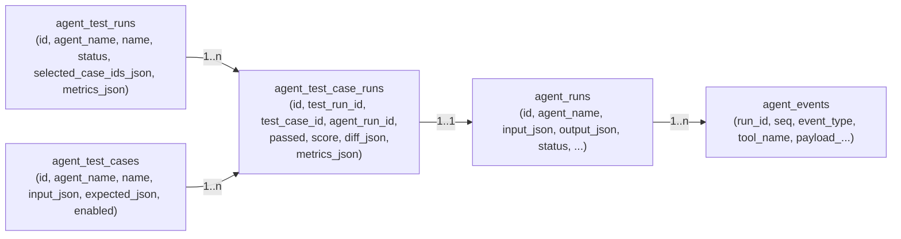

# Agent Tests (Minimal Harness)

This project uses `agent_runs` + `agent_events` as the **trace source of truth**.

The “tests” feature adds a minimal layer that:
- Stores reusable **test cases** per agent
- Stores **test runs** and per-case **pass/fail** + metrics
- Links each executed test case to an `agent_runs.id` so the UI can reuse existing streaming/event viewers

## Data model

## API

### Test cases
- `GET /api/tests/cases?agent_name=vitals_agent`
- `POST /api/tests/cases`
- `PUT /api/tests/cases/{case_id}`
- `DELETE /api/tests/cases/{case_id}`

### Test runs
- `POST /api/tests/runs/start` (creates run + case-run rows)
- `GET /api/tests/runs?agent_name=vitals_agent`
- `GET /api/tests/runs/{run_id}` (run + case-run results)
- `GET /api/tests/runs/{run_id}/stream` (SSE execution; emits `run_start`, `case_start`, `case_done`, `run_done`)

### Traces (existing)
- `GET /api/agent-runs/{agent_run_id}/events/stream`

## Frontend mapping (suggested)
- “Tests” tab lists cases from `GET /api/tests/cases?agent_name=...`
- User selects cases → `POST /api/tests/runs/start`
- UI opens `/api/tests/runs/{run_id}/stream`
  - On each `case_start`, open `/api/agent-runs/{agent_run_id}/events/stream` to show tool trace for the currently running case

